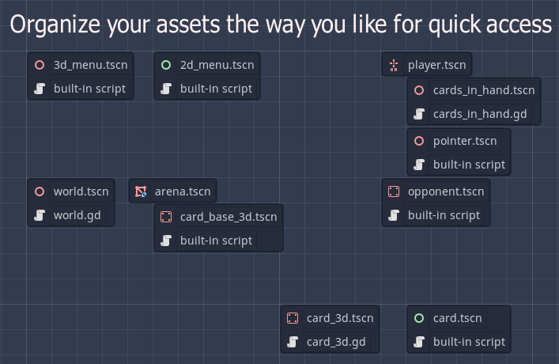
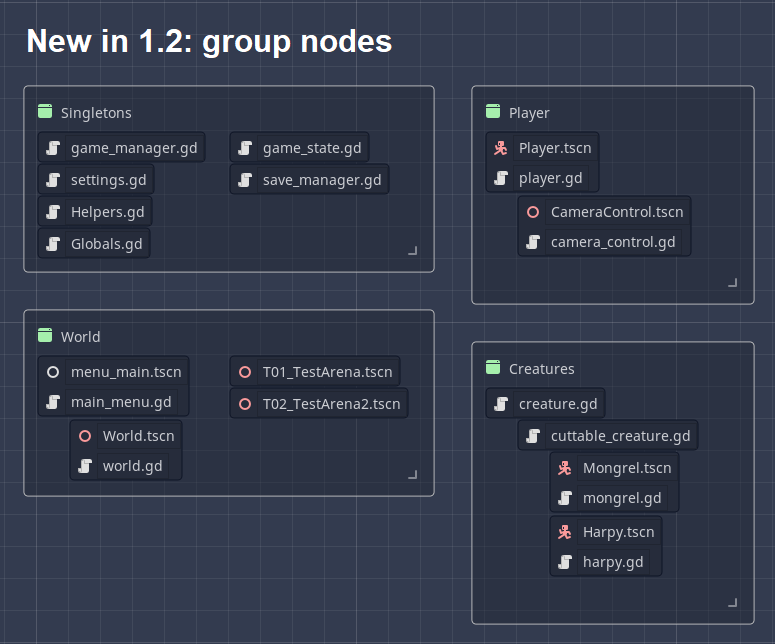

# Project Map plugin for Godot

This adds a new tab "Project" to your editor.

Simply drag and drop files you need to access often into the graph.

Click on the nodes to access the scenes/scripts.

### Group nodes

Provides a visual grouping, no functionality.
Click on "Add Group" button, then click on graph to create a group node.

Drag the icon to move the node.
Press ALT while dragging to move the children at the same time.

You can resize it with the lower right handle.
Selected it by dragging a rect and press delete to delete it

# Changelog

## 1.2 
- Add group node
- Save file node data to improve loading time

## 1.1
- Update graph when moving or deleting files
- Save graph scene under a different name (project_map_save.tscn)
- Can now drag multiple files at once

## 1.0
- Initial release
